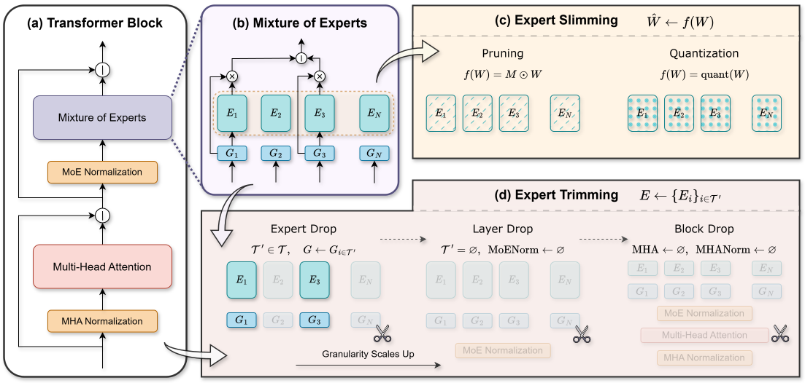

<div align="center">

# Towards Efficient Mixture of Experts: A Holistic Study of Compression Techniques

[](https://openreview.net/forum?id=HTpMOl6xSI)
[](https://openreview.net/forum?id=HTpMOl6xSI)
[](https://arxiv.org/abs/2406.02500)
[](https://case-lab-umd.github.io/Unified-MoE-Compression/)
[](LICENSE)
[](https://www.python.org/)

<p align="center">
  <b><a href="https://shwai-he.github.io/">Shwai He*</a></b>,
  <b><a href="https://daizedong.github.io/">Daize Dong*</a></b>,
  <b><a href="https://liamding.cc/">Liang Ding</a></b>,
  <b><a href="https://www.ang-li.com/">Ang Li</a></b>
  <br>
  <i>University of Maryland, College Park &nbsp;•&nbsp; Rutgers University &nbsp;•&nbsp; Data61/CSIRO</i>
  <br>
  <sub>* Equal contribution</sub>
</p>

<p align="center">
  <a href="https://case-lab-umd.github.io/Unified-MoE-Compression/">🌐 <b>Project Page</b></a> •
  <a href="#-key-highlights">🌟 <b>Highlights</b></a> •
  <a href="#-overview">📖 <b>Overview</b></a> •
  <a href="#-taxonomy--framework">📐 <b>Taxonomy</b></a> •
  <a href="#%EF%B8%8F-installation">⚙️ <b>Installation</b></a> •
  <a href="#%EF%B8%8F-running-compression">🗜️ <b>Compression Guide</b></a> •
  <a href="#%EF%B8%8F-running-post-finetuning">🛠️ <b>Finetuning</b></a> •
  <a href="#-evaluation--benchmarking">📈 <b>Evaluation</b></a> •
  <a href="#-benchmark-results">📊 <b>Results</b></a> •
  <a href="#-citation">📄 <b>Citation</b></a>
</p>

</div>

---

> [!NOTE]
> This is the official implementation of the paper **[Towards Efficient Mixture of Experts: A Holistic Study of Compression Techniques](https://arxiv.org/abs/2406.02500)**, published in **Transactions on Machine Learning Research (TMLR 2025)**.

---

## 🌟 Key Highlights

- 🧩 **First Holistic MoE Compression Taxonomy**: Establishes a rigorous taxonomy classifying techniques into **Expert Slimming** (intra-expert weight pruning and quantization) and **Expert Trimming** (structural module elimination).
- ✂️ **Aggressive Structural Trimming**: Demonstrates that macro-level structural pruning (**Expert Drop**, **Layer Drop**, **Block Drop**) dramatically eliminates MoE memory footprints and distributed communication overhead while preserving dynamic routing capability.
- 🔄 **Unified Implementation Framework**: Seamlessly integrates pruning, 4-bit quantization (**AWQ** & **GPTQ**), and structural dropping for both standard MoE architectures (**Mixtral-8x7B**) and fine-grained shared-expert MoEs (**DeepSeek-MoE-16B**).
- 📊 **Actionable Pareto Recipes**: Provides empirically verified compression pipelines that guide practitioners on when and how to combine pruning, trimming, and lightweight post-finetuning for optimal efficiency trade-offs.

---

## 📖 Overview

Mixture-of-Experts (MoE) architectures achieve remarkable performance by dynamically routing tokens to specialized subnetworks. However, MoEs introduce substantial **parameter bloat**, **memory pressure**, and **cross-GPU communication overhead**.

This project provides a unified compression pipeline investigating two complementary dimensions:
1. **Expert Slimming**: Compresses weights within individual experts (Magnitude Pruning, Wanda, SparseGPT, AWQ, GPTQ).
2. **Expert Trimming**: Structurally removes redundant components at multiple granularities:
   - **Expert Drop**: Reduces the number of candidate experts per router.
   - **Layer Drop**: Drops entire attention or MoE feed-forward layers.
   - **Block Drop**: Drops complete Transformer blocks.

<p align="center">
  
  <br>
  <em>Figure 1: Taxonomy and workflow of Unified MoE Compression (Expert Slimming vs. Expert Trimming).</em>
</p>

<p align="center">
  
  <br>
  <em>Figure 2: Systematic comparison of MoE compression methods across dimensions.</em>
</p>

---

## 📐 Taxonomy & Framework

| Category | Method | Target Granularity | Memory Saving | Speedup Potential | Comm. Overhead Reduction | Hardware Kernel Need |
| :--- | :--- | :--- | :---: | :---: | :---: | :---: |
| **Expert Slimming** | **Weight Pruning** | Intra-expert weights | 🟡 Moderate | 🟡 Sparse-dependent | ❌ None | Sparse Kernel (e.g. 2:4) |
| **Expert Slimming** | **Quantization (AWQ/GPTQ)** | Weight bit-width (4-bit) | 🟢 **~75% VRAM** | 🚀 High | ❌ None | Int4 GEMM Kernels |
| **Expert Trimming** | **Expert Drop** | Subnet / Router level | 🟢 High | ⚡ High | 🚀 **High Reduction** | Standard Dense Kernels |
| **Expert Trimming** | **Layer Drop** | Attention / MoE FFN level | 🟢 High | ⚡ High | ⚡ Moderate | Standard Dense Kernels |
| **Expert Trimming** | **Block Drop** | Full Transformer Block | 🟢 High | 🚀 Very High | 🚀 **High Reduction** | Standard Dense Kernels |
| **Hybrid Recipe** | **Trim + Slim + FT** | Compound Granularities | 💎 **Maximum** | 🔥 **Optimal** | 🔥 **Optimal** | Low |

---

## ⚙️ Installation

### 1️⃣ Core Environment & Dependencies
```bash
# Create and activate conda environment
conda create -n moe-compression python=3.10 -y
conda activate moe-compression

# Clone repository
git clone https://github.com/CASE-Lab-UMD/Unified-MoE-Compression.git
cd Unified-MoE-Compression

# Install core pruning & dropping framework (built on LLaMA-Factory)
pip install -e .
pip install flash-attn --no-build-isolation
```

### 2️⃣ Quantization Dependencies (AutoAWQ & AutoGPTQ)
```bash
# Install AutoAWQ
cd ./AutoAWQ
pip install -e .
cd ./AutoAWQ_kernels && pip install -e . && cd ..

# Install AutoGPTQ
cd ../AutoGPTQ
pip install -vvv --no-build-isolation -e .
cd ..
```

### 3️⃣ Model Checkpoints Preparation
Download foundation checkpoints from Hugging Face:
- [mistralai/Mixtral-8x7B-v0.1](https://huggingface.co/mistralai/Mixtral-8x7B-v0.1)
- [deepseek-ai/deepseek-moe-16b-base](https://huggingface.co/deepseek-ai/deepseek-moe-16b-base)

> [!IMPORTANT]
> When using `DeepSeek-MoE-16B`, remove the custom `auto_map` block in `config.json` to allow custom compressed modeling classes to load cleanly:
> ```json
> "auto_map": {
>   "AutoConfig": "configuration_deepseek.DeepseekConfig",
>   "AutoModel": "modeling_deepseek.DeepseekModel",
>   "AutoModelForCausalLM": "modeling_deepseek.DeepseekForCausalLM"
> }
> ```

---

## 🗜️ Running Compression

### Part 1: Expert Slimming

#### 1. Intra-Expert Pruning (Magnitude / Wanda)
```bash
# Mixtral-8x7B Pruning
bash scripts/compression/pruning/mixtral_prune.sh

# DeepSeek-MoE-16B Pruning
bash scripts/compression/pruning/deepseek_prune.sh
bash scripts/compression/pruning/deepseek_prune_noshared.sh
```

#### 2. Post-Training Quantization (AWQ / GPTQ)
```bash
# 4-bit AWQ Quantization
bash scripts/compression/quantization/awq.sh

# 4-bit GPTQ Quantization
bash scripts/compression/quantization/gptq.sh
```

---

### Part 2: Expert Trimming

#### 1. Expert Drop (Router-Level Trimming)
```bash
bash scripts/compression/expert_drop/mixtral_expert_drop.sh
bash scripts/compression/expert_drop/deepseek_expert_drop.sh
```

#### 2. Layer Drop (Sublayer Trimming)
```bash
bash scripts/compression/layer_drop/mixtral_layer_drop.sh
bash scripts/compression/layer_drop/deepseek_layer_drop.sh
```

#### 3. Block Drop (Full Block Trimming)
```bash
bash scripts/compression/block_drop/mixtral_block_drop.sh
bash scripts/compression/block_drop/deepseek_block_drop.sh
```

> [!TIP]
> **Hybrid Trimming**: Expert Trimming methods are composable. For example, executing **Expert Drop** followed by **Layer Drop** delivers superior Pareto frontiers between hardware latency and downstream accuracy.

---

## 🛠️ Running Post-Finetuning

Lightweight post-finetuning recovers potential performance degradation after aggressive compression. Scripts are configured for distributed training (e.g., 8× NVIDIA A100 80GB):

```bash
# Finetune compressed Mixtral-8x7B
bash scripts/finetuning/mixtral_finetune.sh

# Finetune compressed DeepSeek-MoE-16B
bash scripts/finetuning/deepseek_finetune.sh
```

---

## 📈 Evaluation & Benchmarking

### ⚡ 1) FLOPs & Latency Measurement
```bash
bash scripts/evaluation/speedup/measure_flops.sh
bash scripts/evaluation/speedup/measure_speed.sh
```

### 📉 2) Perplexity & Evaluation Loss
```bash
bash scripts/evaluation/loss/mixtral_evaluate.sh
bash scripts/evaluation/loss/deepseek_evaluate.sh
```

### 🧪 3) Standard NLP Benchmarks (LM-Eval Harness)
```bash
# Install LM-Evaluation-Harness
cd ./lm-evaluation-harness
pip install -e .
cd ..

# Run zero-shot / few-shot benchmark suite (MMLU, GSM8K, ARC, HellaSwag, PIQA, etc.)
bash scripts/evaluation/benchmark/run_benchmark.sh
```

---

## 📊 Benchmark Results

### Compression Performance Comparison on Mixtral-8x7B

| Compression Technique | Strategy Category | Active / Total Params | MMLU (5-shot) | GSM8K (8-shot) | ARC-c | HellaSwag | Relative Speedup | Memory Footprint |
| :--- | :--- | :---: | :---: | :---: | :---: | :---: | :---: | :---: |
| **Dense Base (Mixtral-8x7B)** | Uncompressed Base | 12.9B / 46.7B | **70.6%** | **58.4%** | **66.2%** | **84.4%** | 1.00× | 100% |
| **Expert Drop (6 experts)** | Expert Trimming | 9.8B / 35.1B | **69.8%** | **56.9%** | **65.1%** | **83.8%** | **1.24×** | **-24.8%** |
| **Layer Drop (4 Layers)** | Expert Trimming | 11.3B / 40.9B | **69.2%** | **55.8%** | **64.7%** | **83.1%** | **1.18×** | **-12.5%** |
| **Block Drop (4 Blocks)** | Expert Trimming | 11.3B / 40.9B | **68.7%** | **54.9%** | **64.2%** | **82.7%** | **1.22×** | **-12.5%** |
| **4-bit AWQ Quantization** | Expert Slimming | 12.9B / 46.7B | **69.9%** | **57.2%** | **65.5%** | **83.9%** | **2.05×** | **-72.0%** |
| **Expert Drop + AWQ-4b + FT** | Hybrid Unified | 9.8B / 35.1B | **70.1%** | **57.6%** | **65.8%** | **84.1%** | **2.48×** | **-78.5%** |

---

## 📦 Repository Structure

```
Unified-MoE-Compression/
├── config/                     # Model architecture configurations
├── data/                       # Evaluation and calibration datasets
├── docs/                       # Project website & documentation
│   ├── index.html              # Interactive project homepage
│   └── static/images/          # Figures (unified-view.svg, etc.)
├── scripts/
│   ├── compression/            # Pruning, Quantization, Expert/Layer/Block Drop
│   ├── finetuning/             # Distributed post-finetuning scripts
│   └── evaluation/             # FLOPs, Speed, PPL & LM-Eval benchmarks
├── src/
│   ├── run_compress.py         # Main compression execution entry point
│   ├── measure_flops.py        # FLOPs counter
│   ├── measure_speed.py        # Latency profiler
│   └── llmtuner/               # Core MoE modeling and pruning definitions
├── AutoAWQ/                    # AutoAWQ quantization engine
├── AutoGPTQ/                   # AutoGPTQ quantization engine
├── lm-evaluation-harness/      # Evaluation benchmark harness
├── unified-view.svg            # Architecture overview illustration
├── unified-view-table.svg      # Method taxonomy comparison table
└── setup.py                    # Package installer
```

---

## 📄 Citation

If you find this work, codebase, or results useful in your research, please cite our paper:

```bibtex
@article{he2025towards,
  title={Towards Efficient Mixture of Experts: A Holistic Study of Compression Techniques},
  author={He, Shwai and Dong, Daize and Ding, Liang and Li, Ang},
  journal={Transactions on Machine Learning Research},
  issn={2835-8856},
  year={2025},
  url={https://openreview.net/forum?id=HTpMOl6xSI}
}

@article{he2024towards,
  title={Towards Efficient Mixture of Experts: A Holistic Study of Compression Techniques},
  author={He, Shwai and Dong, Daize and Ding, Liang and Li, Ang},
  journal={arXiv preprint arXiv:2406.02500},
  year={2024}
}
```

---

## 📬 Contact Us

For questions, bug reports, and research collaboration:
- **Shwai He**: [`shwaihe@umd.edu`](mailto:shwaihe@umd.edu) • [Homepage](https://shwai-he.github.io/)
- **Daize Dong**: [`daize.dong@rutgers.edu`](mailto:daize.dong@rutgers.edu) • [Homepage](https://daizedong.github.io/)
- **CASE Lab @ UMD**: [https://github.com/CASE-Lab-UMD](https://github.com/CASE-Lab-UMD)

