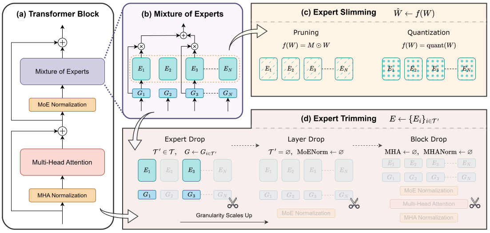

# Demystifying the Compression of Mixture-of-Experts Through a Unified Framework

**[Shwai He](https://shwai-he.github.io/)\*, [Daize Dong](https://daizedong.github.io/)\*, [Liang Ding](https://liamding.cc/), [Ang Li](https://www.ang-li.com/)**

> **This is the official implementation of the paper [Demystifying the Compression of Mixture-of-Experts Through a Unified Framework](https://arxiv.org/abs/2406.02500).** We provide a comprehensive framework for compressing Mixture-of-Experts models. 


## Introduction

The Mixture of Experts (MoE) approach dynamically selects and activates only a subset of experts, significantly reducing computational costs while maintaining high performance. However, MoE introduces potential redundancy (e.g., parameters) and extra costs (e.g., communication overhead). Since the compression of MoE remains under-explored, we address this gap with a cutting-edge unified framework that seamlessly integrates mainstream compression methods and helps systematically understand MoE compression. This framework approaches compression from two perspectives: Expert Slimming, which compresses individual experts, and Expert Trimming, which removes structured modules. Within this framework, we explore the optimization space unexplored by existing methods
and introduce aggressive Expert Trimming techniques, such as Layer Drop and Block Drop, to eliminate redundancy on a larger scale. Based on these insights, we present a comprehensive recipe to guide practitioners in effectively compressing MoE.




## Installation

#### Environment

Create conda environment and install the pipeline for pruning and Expert Trimming (based on the [LLaMA-Factory](https://github.com/hiyouga/LLaMA-Factory)).

```bash
conda create -n moe-compression python=3.10
conda activate moe-compression

git clone git@github.com:DaizeDong/Unified-MoE-Compression.git
cd ./Unified-MoE-Compression
pip install -e .
pip install flash-attn --no-build-isolation
```

Install the pipeline for quantization (based on the [AutoAWQ](https://github.com/casper-hansen/AutoAWQ) and [AutoGPTQ](https://github.com/AutoGPTQ/AutoGPTQ)). Ensure you carefully install the packages that correspond to your CUDA version. For more details you can refer to the README files in corresponding folders.

```bash
cd ./AutoAWQ
pip install -e .

cd ./AutoAWQ/AutoAWQ_kernels
pip install -e .

cd ./AutoGPTQ
pip install -vvv --no-build-isolation -e .
```


#### Prepare Models

Download the [Mixtral-8x7B](https://huggingface.co/mistralai/Mixtral-8x7B-v0.1) and [DeepSeek-MoE-16B](https://huggingface.co/deepseek-ai/deepseek-moe-16b-base) model from HuggingFace, and **delete** the following lines in the `config.json` of DeepSeek-MoE-16B.

```json
"auto_map": {
  "AutoConfig": "configuration_deepseek.DeepseekConfig",
  "AutoModel": "modeling_deepseek.DeepseekModel",
  "AutoModelForCausalLM": "modeling_deepseek.DeepseekForCausalLM"
},
```


## Running Compression

### Expert Slimming

#### Pruning

```bash
bash scripts/compression/pruning/mixtral_prune.sh
bash scripts/compression/pruning/deepseek_prune.sh
bash scripts/compression/pruning/deepseek_prune_noshared.sh
```

#### Quantization

```bash
bash scripts/compression/quantization/awq.sh
bash scripts/compression/quantization/gptq.sh
```


### Expert Trimming

> Note that the Expert Trimming methods can also be combined with each other. For example, you can apply Expert Drop after Layer Drop. This may provide better trade-off between performance and efficiency.

#### Expert Drop

```bash
bash scripts/compression/expert_drop/mixtral_expert_drop.sh
bash scripts/compression/expert_drop/deepseek_expert_drop.sh
```

#### Layer Drop

```bash
bash scripts/compression/layer_drop/mixtral_layer_drop.sh
bash scripts/compression/layer_drop/deepseek_layer_drop.sh
```

#### Block Drop

```bash
bash scripts/compression/block_drop/mixtral_block_drop.sh
bash scripts/compression/block_drop/deepseek_block_drop.sh
```


## Running Post-Finetuning

We provide example scripts for finetuning the Mixtral-8x7B and DeepSeek-MoE-16B. Just run:

```bash
bash scripts/finetuning/mixtral_finetune.sh
bash scripts/finetuning/deepseek_finetune.sh
```


## Running Evaluation

#### FLOPs & Speed

```bash
bash scripts/evaluation/speedup/measure_flops.sh
bash scripts/evaluation/speedup/measure_speed.sh
```

#### Loss & PPL

```bash
bash scripts/evaluation/loss/mixtral_evaluate.sh
bash scripts/evaluation/loss/deepseek_evaluate.sh
```

#### Benchmarks

You should first install the pipeline for evaluation (based on the [EleutherAI/lm-evaluation-harness](https://github.com/EleutherAI/lm-evaluation-harness)).

```bash
cd ./lm-evaluation-harness
pip install -e .
```

Then run the following script:

```bash
bash scripts/evaluation/benchmark/run_benchmark.sh
```


## Others

To add a dataset, please refer to the [README.md](data%2FREADME.md) in `./data`.


## Citation

```latex
@article{he2024demystifying,
  title={Demystifying the Compression of Mixture-of-Experts Through a Unified Framework},
  author={He, Shwai and Dong, Daize and Ding, Liang and Li, Ang},
  journal={arXiv preprint arXiv:2406.02500},
  year={2024}
}
```


## Contact Us

If you have any questions, please contact:

- Shwai He: shwaihe@umd.edu

- Daize Dong: dzdong2019@gmail.com
